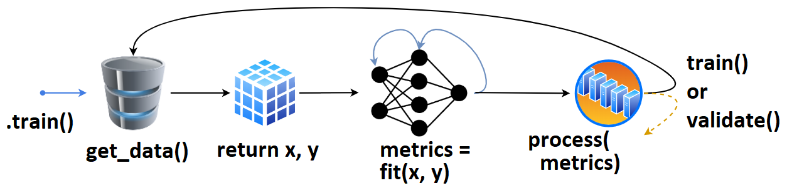
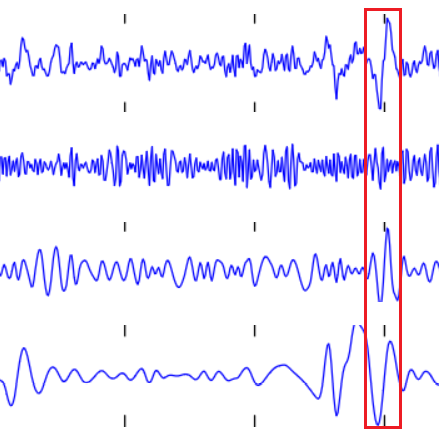
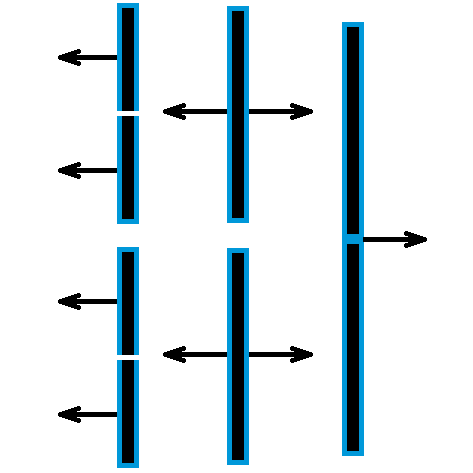

<p align="center"></p>

# DeepTrain

[](https://travis-ci.com/OverLordGoldDragon/dev_tg)
[](https://coveralls.io/github/OverLordGoldDragon/dev_tg)
[](https://www.codacy.com/manual/OverLordGoldDragon/dev_tg?utm_source=github.com&amp;utm_medium=referral&amp;utm_content=OverLordGoldDragon/dev_tg&amp;utm_campaign=Badge_Grade)
[](https://dev-tg.readthedocs.io/en/latest/?badge=latest)
[](https://opensource.org/licenses/MIT)


Full knowledge and control of the train state.


## Features

DeepTrain is founded on **control** and **introspection**: full knowledge and manipulation of the train state.

### Train Loop

  - **Control**: iteration-, batch-, epoch-level customs
  - **Resumability**: interrupt-protection, can pause mid-training
  - **Tracking & reproducibility**: save & load model, train state, random seeds, and hyperparameter info
  - **Callbacks** at any stage of training or validation

### Data Pipeline

  - **AutoData**: need only path to directory, the rest is inferred (but can customize)
  - **Faster SSD loading**: load larger batches to maximize read speed utility
  - **Flexible batch size**: can differ from that of loaded files, will split/combine
  - **Stateful timeseries**: splits up a batch into windows, and `reset_states()` (RNNs) at end
  
### Introspection

  - **Data**: batches and labels are enumerated by "set nums"; know what's being fit and when
  - **Model**: auto descriptive naming; gradients, weights, activations visuals
  - **Train state**: single-image log of key attributes & hyperparameters for easy reference

### Utilities

  - **Calibration**: classifier prediction threshold; best batch subset selection (for e.g. ensembling)
  - **Algorithms**: convenience methods for object inspection & manipulation
  - **Preprocessing**: batch-making and format conversion methods

## When is DeepTrain suitable (and not)?

Training _few_ models _thoroughly_: closely tracking model and train attributes to debug performance and inform next steps.

DeepTrain is _not_ for models that take under an hour to train, or for training hundreds of models at once.

## How it works

<p align="center"></p>


 1. We define `tg = TrainGenerator(**configs)`,
 2. call `tg.train()`.<br>
 3. `get_data()` is called, returning data & labels,<br>
 4. fed to `model.fit()`, returning `metrics`,<br>
 5. which are then printed, recorded.<br>
 6. The loop repeats, or `validate()` is called.<br>

Once `validate()` finishes, training may checkpoint, and `train()` is called again. Internally, data loads with `DataGenerator.load_data()` (using e.g. `np.load`).

That's the high-level overview; more detail [here](https://dev-tg.readthedocs.io/en/latest/how_works.html). Callbacks and other behavior can be configured for every stage of training.

## Examples

<a href="https://dev-tg.readthedocs.io/en/latest/examples/advanced.html">MNIST AutoEncoder</a> | <a href="https://dev-tg.readthedocs.io/en/latest/examples/misc/timeseries.html">Timeseries Classification</a> | <a href="https://dev-tg.readthedocs.io/en/latest/examples/misc/model_health.html">Health Monitoring</a>
:----------------:|:-----------------:|:-----------------:
<a href="https://dev-tg.readthedocs.io/en/latest/examples/advanced.html"><a>|<a href="https://dev-tg.readthedocs.io/en/latest/examples/misc/timeseries.html"></a>|<a href="https://dev-tg.readthedocs.io/en/latest/examples/misc/model_health.html"></a>
  
<a href="https://dev-tg.readthedocs.io/en/latest/examples/callbacks/mnist.html">Tracking Weights</a> | <a href="https://dev-tg.readthedocs.io/en/latest/examples/misc/reproducibility.html">Reproducibility</a> | <a href="https://dev-tg.readthedocs.io/en/latest/examples/misc/flexible_batch_size.html">Flexible batch_size</a>
:----------------:|:----------------:|:----------------:|
<a href="https://dev-tg.readthedocs.io/en/latest/examples/callbacks/mnist.html"></a>|<a href="https://dev-tg.readthedocs.io/en/latest/examples/misc/reproducibility.html"></a>|<a href="https://dev-tg.readthedocs.io/en/latest/examples/misc/flexible_batch_size.html"></a>


## Installation

`pip install deeptrain` (without data; see [how to run examples](https://dev-tg.readthedocs.io/en/latest/how_to.html#run-examples)), or clone repository

## Quickstart

To run, DeepTrain requires (1) a compiled model; (2) data directories (train & val). Below is a minimalistic example.

Checkpointing, visualizing, callbacks & more can be accomplished via additional arguments; see [Basic](https://dev-tg.readthedocs.io/en/latest/examples/basic.html) and [Advanced](https://dev-tg.readthedocs.io/en/latest/examples/advanced.html) examples. 
Also see [Recommended Usage](https://dev-tg.readthedocs.io/en/latest/recommended_usage.html).

```python
from tensorflow.keras.layers import Input, Dense
from tensorflow.keras.models import Model
from deeptrain import TrainGenerator, DataGenerator

ipt = Input((16,))
out = Dense(10, 'softmax')(ipt)
model = Model(ipt, out)
model.compile('adam', 'categorical_crossentropy')

dg  = DataGenerator(data_path="data/train", labels_path="data/train/labels.npy")
vdg = DataGenerator(data_path="data/val",   labels_path="data/val/labels.npy")
tg  = TrainGenerator(model, dg, vdg, epochs=3, logs_dir="logs/")

tg.train()
```

## In future releases

 - `MetaTrainer`: direct support for dynamic model recompiling with changing hyperparameters, and optimizing thereof
 - PyTorch support
